# Vio - Architecture Documentation

## 📊 Database Schema Architecture

### Entity Relationship Diagram

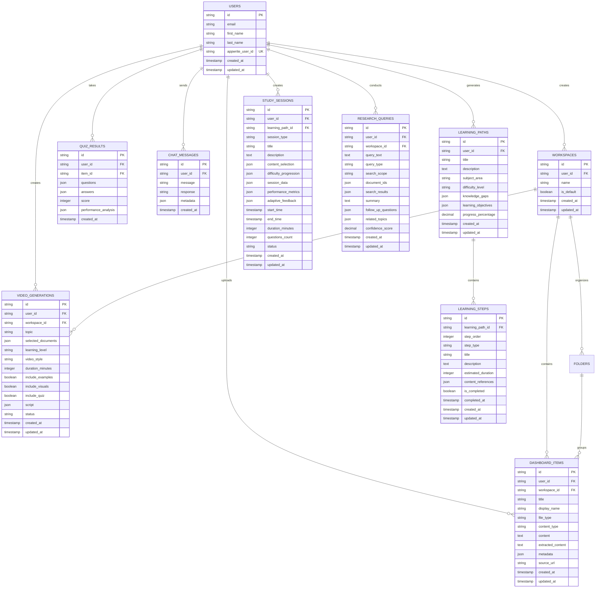

## 🔄 Data Flow Diagrams

### Universal Content Upload & Processing Flow

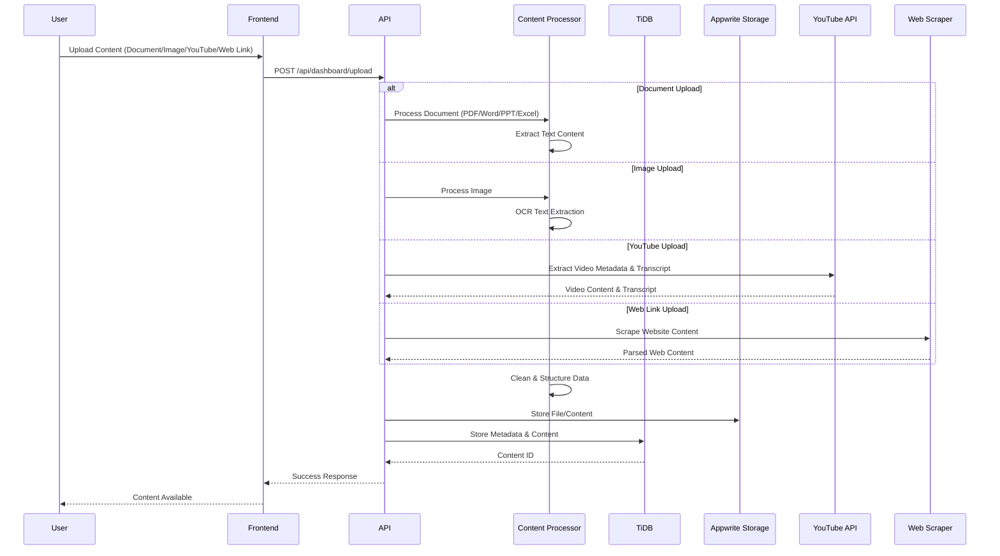

### AI Chat Interaction Flow

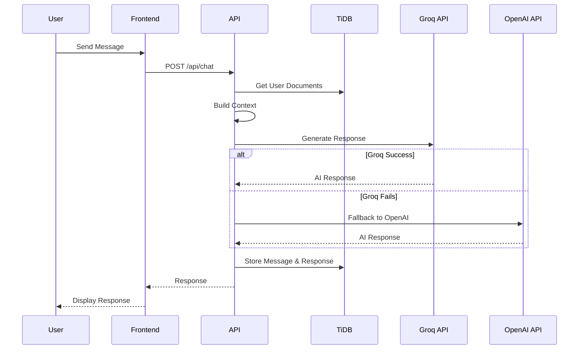

### Study Session Orchestration Flow

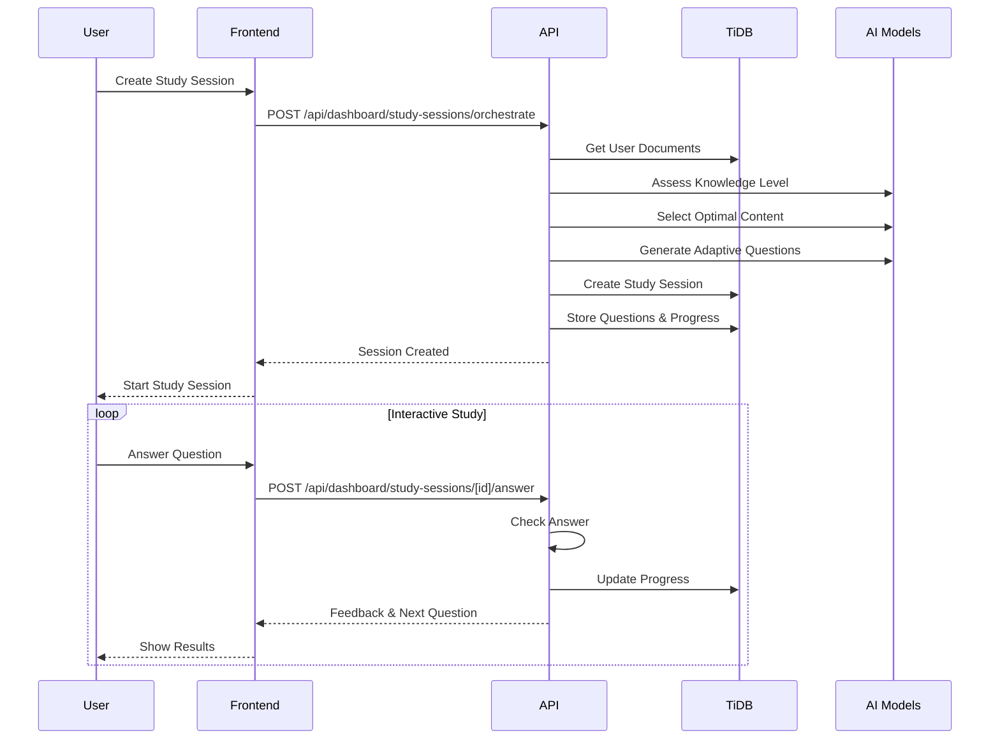

### Learning Path Generation Flow

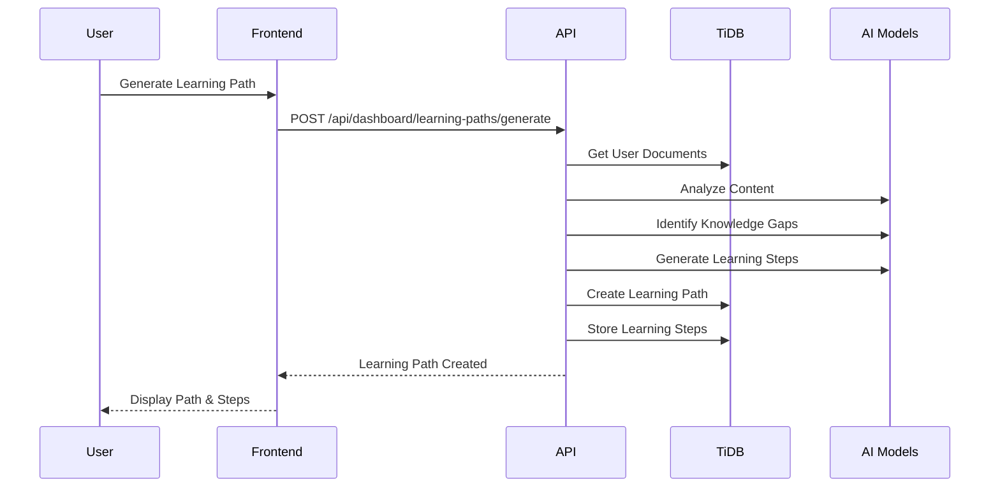

### Video Generation Flow

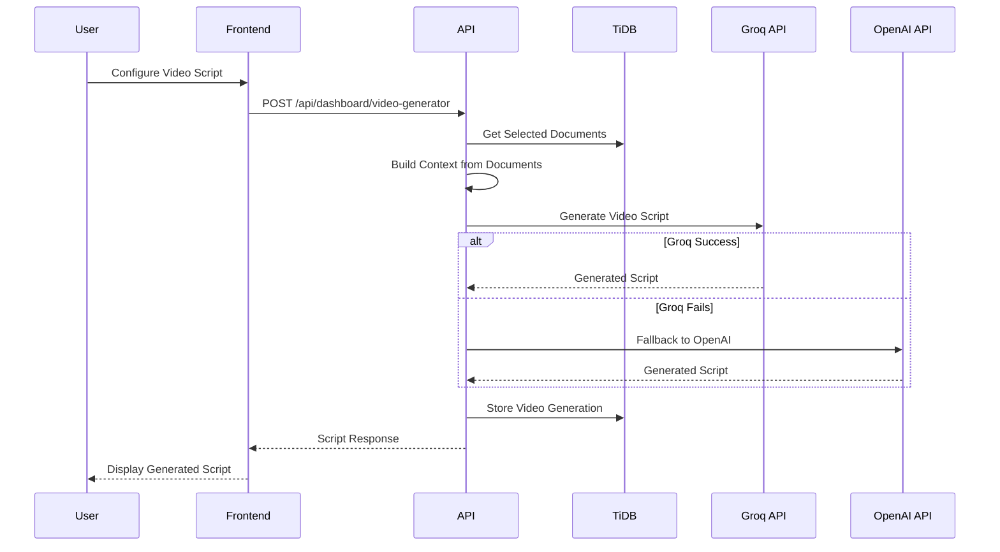

### Authentication Flow

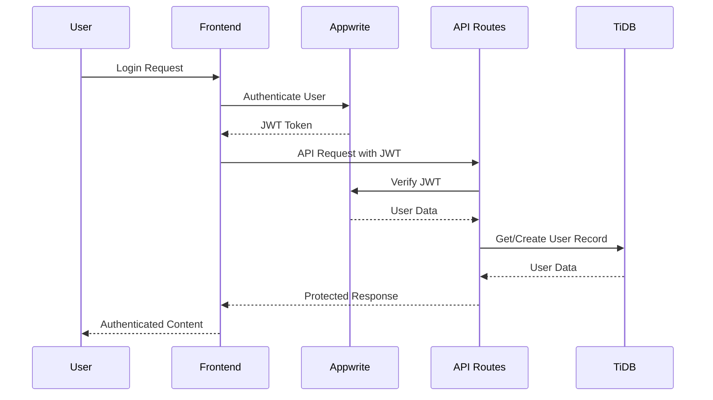

## 🤖 AI Integration Architecture

### Multi-Model Architecture

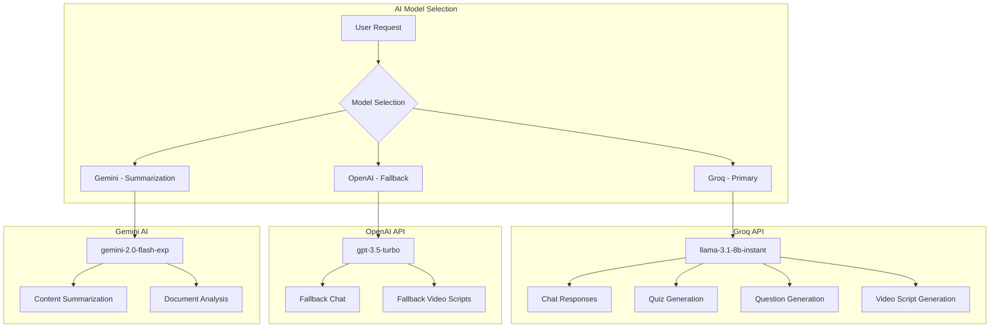

### Data Processing Pipeline

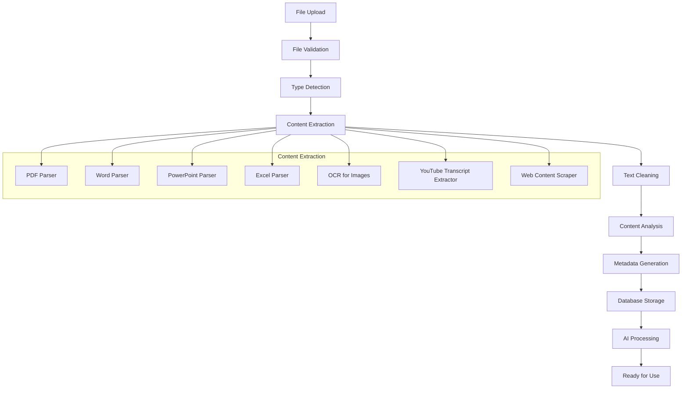

### AI Processing Pipeline

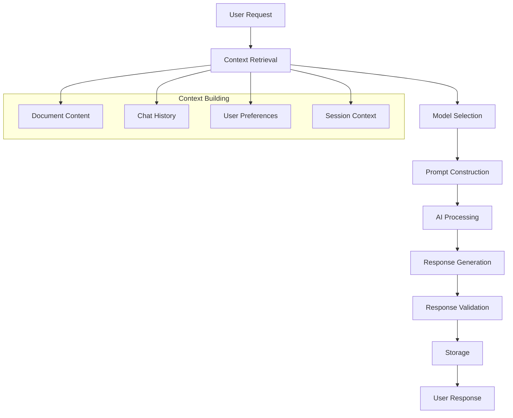

## 🗄️ Database Layer Details

### Core Tables

#### Users & Authentication
- **`users`**: User profiles and authentication data
- **`workspaces`**: User workspace organization with default workspace support

#### Content Management
- **`dashboard_items`**: Universal content metadata, content, and extracted text (documents, images, videos, web links)
- **`folders`**: Hierarchical content organization
- **`item_folders`**: Many-to-many relationship between items and folders

#### Learning & Assessment
- **`quiz_results`**: Quiz attempts, scores, and detailed performance analysis
- **`chat_messages`**: Conversation history and AI interactions
- **`learning_paths`**: AI-generated personalized learning paths
- **`learning_steps`**: Individual steps within learning paths
- **`study_sessions`**: Adaptive study sessions with progress tracking
- **`research_queries`**: Research assistant queries and results
- **`video_generations`**: Educational video script generation requests and results

### Data Relationships

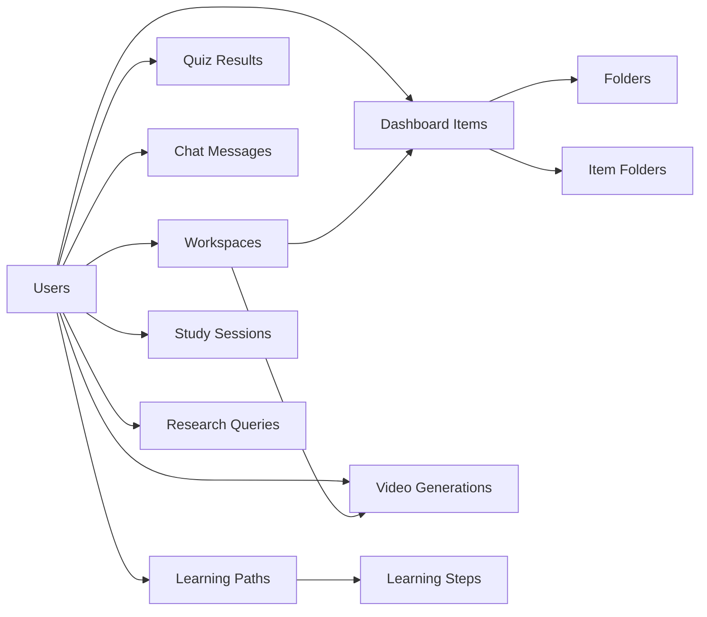

## 🔐 Security Architecture

### Authentication & Authorization

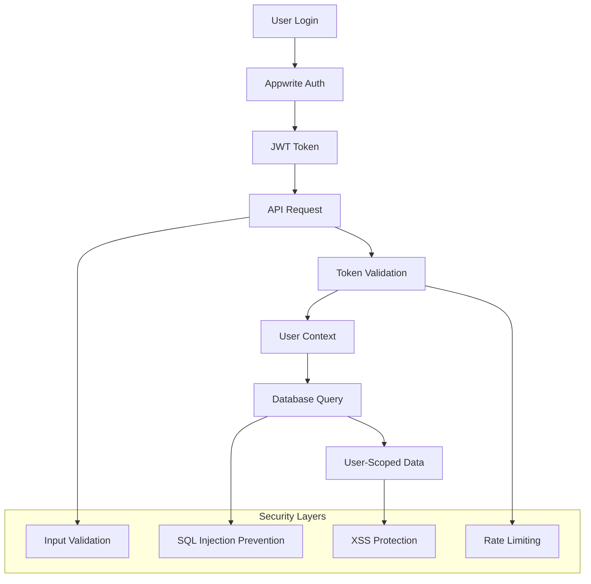

## 🛠️ Recent System Improvements

### API Enhancements (Latest Updates)

#### Search Functionality
- **TiDB Integration**: Migrated search from Appwrite to TiDB for better performance
- **User ID Mapping**: Implemented proper Appwrite-to-TiDB user ID mapping
- **Multi-Content Search**: Search across documents, folders, and quiz results
- **Workspace Scoping**: Search results scoped to user's workspace

#### Delete Operations
- **Learning Paths**: Added DELETE endpoint for learning path management
- **Research Queries**: Implemented research query deletion with user verification
- **Study Sessions**: Added study session deletion with proper authorization
- **Security**: All delete operations include ownership verification

#### UI/UX Improvements
- **Scrollable Content**: Made context selection and generated content lists scrollable
- **Hover Effects**: Added delete buttons that appear on hover for better UX
- **Auto-resize Textarea**: Fixed textarea auto-resize for programmatic content insertion
- **Sidebar Navigation**: Improved active tab highlighting with URL synchronization

#### Error Handling
- **JSON Parsing**: Enhanced AI response parsing with regex extraction and fallback handling
- **API Fallbacks**: Improved error handling for AI service failures
- **User Feedback**: Better error messages and loading states

### System Reliability Features

#### Robust AI Integration
- **Multi-Model Fallback**: Groq → OpenAI → Gemini fallback chain
- **Response Validation**: JSON parsing with regex extraction and error recovery
- **Context Management**: Improved context building for AI responses
- **Rate Limiting**: Built-in protection against API abuse

#### Data Consistency
- **Transaction Safety**: ACID compliance for critical operations
- **User Isolation**: Proper data segregation and access control
- **Workspace Management**: Default workspace handling and user verification
- **Content Integrity**: Validation and sanitization of all user inputs

## 📊 Performance Considerations

### Caching Strategy

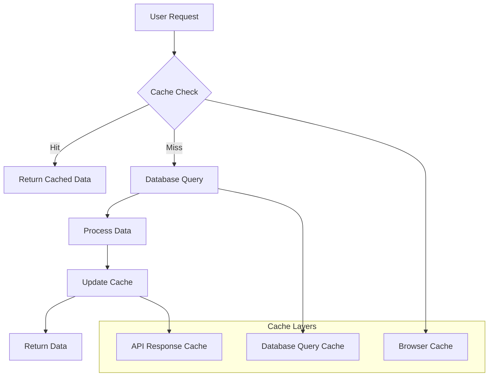

### Scalability Architecture

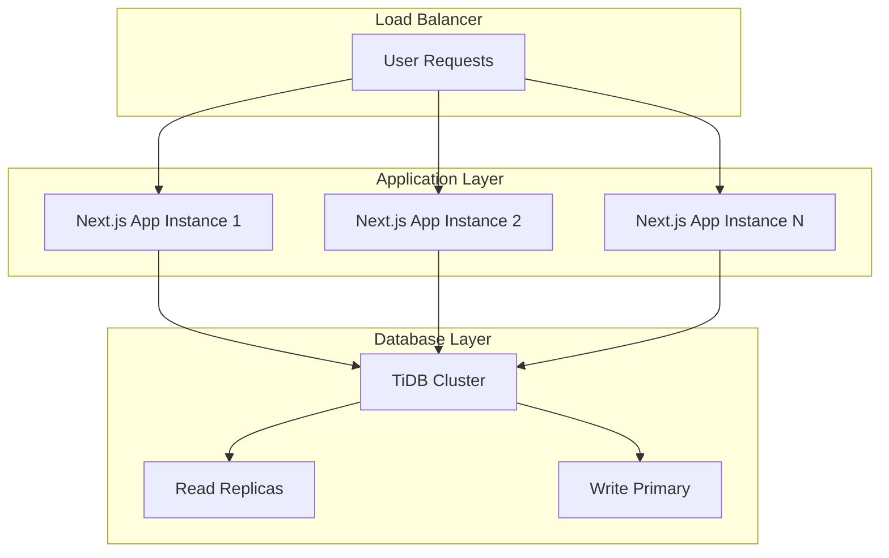
