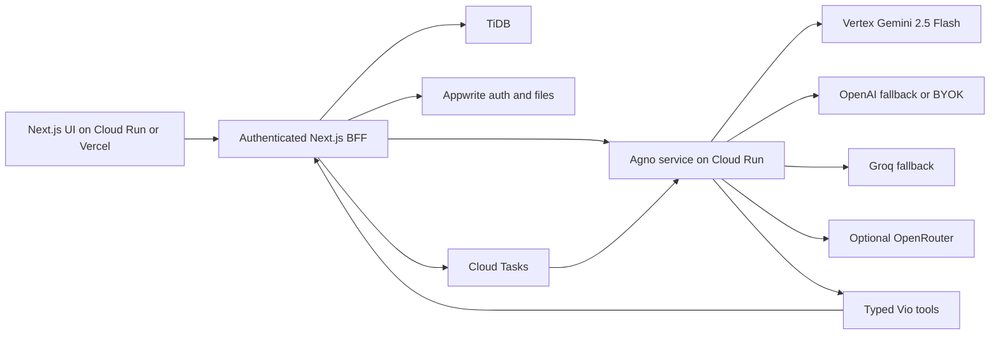

# Vio Architecture

```mermaid
flowchart LR
  U["Next.js UI on Cloud Run or Vercel"] --> B["Authenticated Next.js BFF"]
  B --> D["TiDB"]
  B --> S["Appwrite auth and files"]
  B --> A["Agno service on Cloud Run"]
  A --> V["Vertex Gemini 2.5 Flash"]
  A --> O["OpenAI fallback or BYOK"]
  A --> G["Groq fallback"]
  A --> R["Optional OpenRouter"]
  A --> T["Typed Vio tools"]
  T --> B
  B --> Q["Cloud Tasks"]
  Q --> A
```

## Responsibilities

The Next.js application owns browser sessions, resource authorization, UI, credential management, uploads, and the constrained internal tool endpoints. It signs a five-minute agent context token; the agent never receives raw database credentials or unrestricted SQL access.

The FastAPI service owns provider selection, Agno sessions, streaming runs, typed tools, memory/summaries, structured homework evaluation, and retryable provider fallback. Its provider chain is Vertex, OpenAI, then Groq. Invalid input, authorization, billing-boundary, and safety failures do not trigger fallback.

## Data flows

### Agent run

1. The BFF validates the Appwrite JWT and resolves the TiDB user.
2. It loads AI preferences, decrypting a BYOK key only on the server when selected.
3. It creates or resumes a durable conversation and sends signed context to the AI service.
4. The agent selects typed tools. Each tool calls the internal BFF, which rechecks ownership/role.
5. SSE emits message deltas, tool lifecycle events, citations, approval requests, errors, and completion.
6. The BFF persists the final assistant message and run state.

### Memory

- `conversation_messages`: immutable conversational/tool history.
- Agno sessions and `conversation_summaries`: long-context continuity.
- `user_memories`: durable facts with confidence, source, scope, expiry, and supersession.
- `knowledge_documents` and `knowledge_chunks`: ACL-scoped extracted file material, locators, and 768-dimensional Vertex embeddings. Retrieval merges lexical and vector ranks and falls back to lexical search if vector capability is unavailable.
- `audit_events`: mutations and approval history, excluded from conversational recall.

### Homework evaluation

1. Submission text and files create an immutable `submission_versions` record.
2. Cloud Tasks enqueues an idempotent version-specific evaluation.
3. Extracted chunks and assignment/rubric data are sent to structured evaluation.
4. The AI draft is versioned with provider/model/confidence metadata.
5. A teacher reviews, overrides if needed, saves a draft, and explicitly publishes.
6. Students only see published teacher-authoritative results; AI content remains labeled.

## Persistence

Numbered SQL files live in `migrations/`. `scripts/migrate.js` records checksums in `schema_migrations` and refuses changed applied migrations. Learning Studio records are copied to `video_generations_archive`, counted, and only then removed from the active schema.

Appwrite remains the source for identity and binary objects. TiDB is the source for application metadata, classroom state, conversations, memories, evaluations, and audit records.

## Extension points

- Add providers in `services/agent/app/provider.py` behind the normalized selection/fallback contract.
- Add tools in `services/agent/app/tools.py` and a permission-checked handler in the internal Next.js tool route.
- Replace or extend retrieval through the `KnowledgeStore` boundary; hybrid TiDB retrieval is the default and lexical search remains the outage/migration fallback.
- Add new migrations; never edit an already-applied migration.
