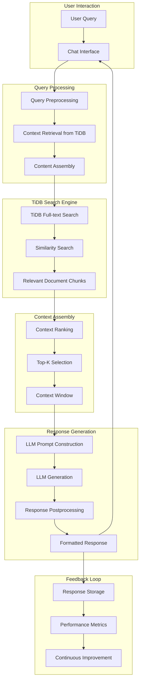
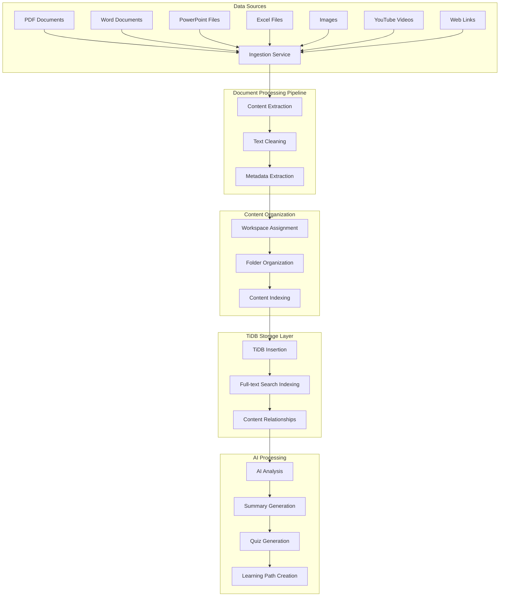
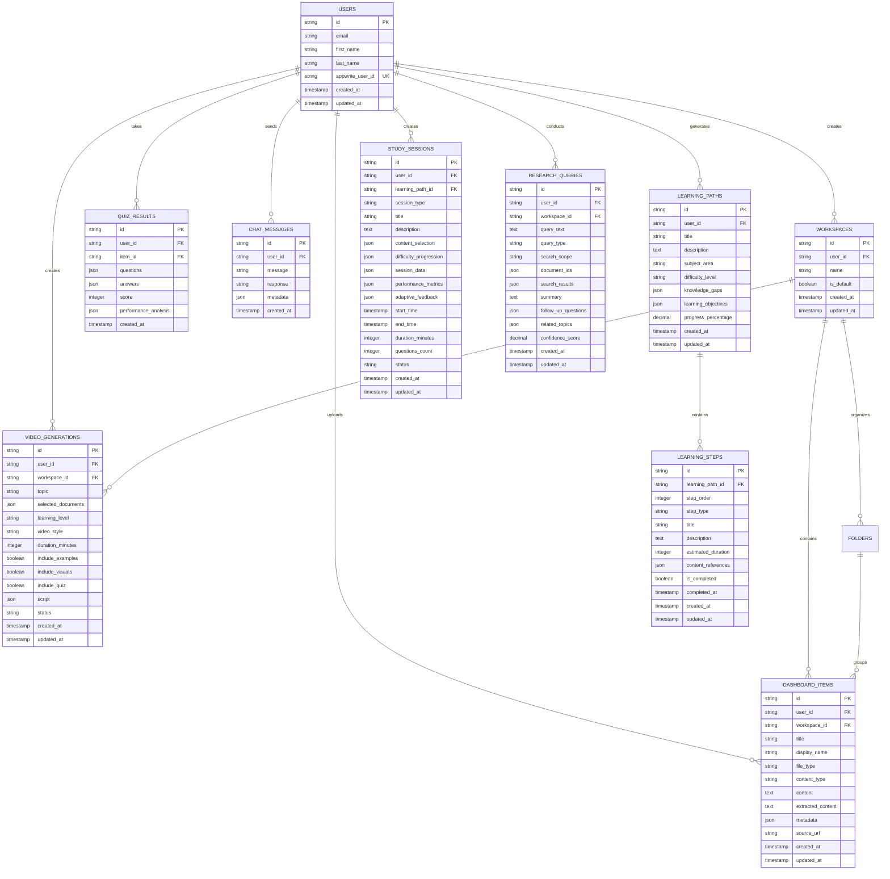
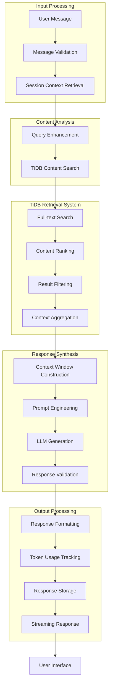

# Vio - AI-Native Learning Companion with TiDB

This project is an AI-powered learning platform that enables users to create personalized learning experiences from various content sources using TiDB as the primary database. It was built for the TiDB AgentX Hackathon 2025.

## Features

**Universal Content Management**: Upload, organize, and manage documents (PDF, Word, PowerPoint, Excel), images, YouTube videos, and website links
**AI-Powered Chat**: Interactive chat interface with context-aware AI responses using multiple AI models
**Smart Summarization**: Automatic content summarization using Gemini AI for better comprehension
**Intelligent Quizzing**: Generate and take quizzes based on uploaded content with multiple question types
**Listening Tests**: Audio-based comprehension tests with text-to-speech integration
**Performance Analytics**: Detailed quiz results with topic-based performance analysis
**Advanced Search**: TiDB-powered semantic search across all documents and content with web search integration
**Workspace Organization**: Create folders and organize content with hierarchical structure
**Content Management**: Delete learning paths, research queries, and study sessions with hover-based UI
**Responsive Design**: Optimized for desktop and mobile with scrollable content areas

## AI Agents & Multi-Step Workflows

**Learning Path Generator**: Creates personalized learning paths based on documents and goals
**Research Assistant**: Conducts comprehensive research across documents with AI-powered analysis
**Study Session Orchestrator**: Creates adaptive study sessions with real-time difficulty adjustment
**Learning Script Studio**: Generates educational video scripts and video from content
**Interactive Study Interface**: Answer questions in real-time with immediate feedback and explanations
**Performance Dashboard**: Comprehensive analytics showing learning trends and improvement areas
**Session Management**: Pause, resume, and track progress across study sessions

## Tech Stack

**Frontend**: Next.js 14, React 18, TypeScript, Tailwind CSS
**Backend**: Next.js API Routes
**Database**: TiDB Serverless with full-text search capabilities
**Authentication**: Appwrite
**AI Services**: Groq API, OpenAI API, Google Gemini
**UI Components**: Radix UI, Shadcn UI
**File Processing**: Advanced PDF processing, OCR, YouTube transcript extraction, Web Scrapping with Firecrawl

## TiDB Architecture Overview

### Advanced RAG (Retrieval-Augmented Generation) System



### Comprehensive Data Pipeline



## Detailed Database Schema with TiDB Features



## Intelligent AI Agent Workflow



## Current Implementation Details

**Database**: TiDB Serverless with full-text search capabilities
**Search Method**: TiDB native full-text search with LIKE queries for content matching
**Content Processing**: Multi-format support with OCR and transcript extraction
**AI Integration**: Multi-model architecture with Groq, OpenAI, and Gemini fallbacks
**Authentication**: Appwrite-based user management with JWT tokens
**File Storage**: Appwrite storage for file management

## Architecture

### Database Schema

The application uses TiDB with the following core tables:

**users**: User profiles and authentication data from Appwrite
**workspaces**: User workspace organization with default workspace support
**dashboard_items**: Universal content metadata, content, and extracted text
**folders**: Hierarchical content organization
**quiz_results**: Quiz attempts, scores, and detailed performance analysis
**chat_messages**: Conversation history and AI interactions
**learning_paths**: AI-generated personalized learning paths
**learning_steps**: Individual steps within learning paths
**study_sessions**: Adaptive study sessions with progress tracking
**research_queries**: Research assistant queries and results
**video_generations**: Educational video script generation requests and results

### Search Implementation

Uses TiDB's native full-text search capabilities with LIKE queries for content matching
Implements user ID mapping between Appwrite and TiDB for proper data isolation
Properly scopes search results to user's workspace for security
Plans to implement vector search for improved semantic similarity

### Multi-Model AI Architecture

**Groq API**: Primary AI model for chat and quiz generation (llama-3.1-8b-instant)
**OpenAI API**: Fallback AI model for chat responses (gpt-3.5-turbo)
**Gemini AI**: Content summarization and analysis (gemini-2.0-flash-exp)
**Text-to-Speech**: Browser-based speech synthesis for listening tests


## Data Flow & Integrations Summary

### Data Flow Architecture
```
User Upload → Content Processing → TiDB Storage → AI Analysis → User Interface
```

**1. Content Ingestion**
- Users upload documents, images, YouTube videos, or web links
- Content is processed through specialized extractors (PDF parsing, OCR, transcript extraction, web scraping)
- Files are stored in Appwrite storage while metadata goes to TiDB

**2. AI Processing Pipeline**
- Content is analyzed and indexed in TiDB for search
- AI models (Groq/OpenAI/Gemini) process content for summaries, quizzes, and learning paths
- Multi-model fallback system ensures reliability

**3. User Interaction**
- TiDB powers semantic search across all content
- AI generates contextual responses based on retrieved content
- Learning analytics and progress tracking stored in TiDB

### Key Integrations

**Database Layer:**
- **TiDB Serverless** - Primary database for content, search, and analytics
- **Appwrite** - Authentication and file storage

**AI Services:**
- **Groq API** - Primary AI model (llama-3.1-8b-instant)
- **OpenAI API** - Fallback AI model (gpt-3.5-turbo)
- **Google Gemini** - Content summarization and analysis
- **Tavily API** - Web search integration

**Content Processing:**
- **Firecrawl** - Web content scraping
- **Tesseract.js** - OCR for images
- **FFmpeg** - Video processing
- **PDF-parse/Mammoth** - Document text extraction

**Frontend:**
- **Next.js 14** - React framework
- **Tailwind CSS** - Styling
- **Radix UI** - Component library

This architecture enables seamless content processing, intelligent search, and personalized learning experiences across all content types.

## Usage

**Create Workspace**: Set up your learning workspace
**Upload Content**: Add documents, images, YouTube videos, or web links
**Organize Content**: Create folders and organize your learning materials
**AI Chat**: Ask questions about your uploaded content
**Generate Quizzes**: Create quizzes from your documents
**Take Study Sessions**: Complete adaptive study sessions
**Use AI Agents**: Test Learning Path Generator, Research Assistant, and Study Session Orchestrator
**Generate Video Scripts**: Create educational video scripts from your content

## API Endpoints

**POST /api/dashboard/upload** - Upload content (documents, images, videos, web links)
**GET /api/dashboard/search** - Search across all content types
**POST /api/chat** - Chat with AI using content context
**POST /api/dashboard/quizes/generate** - Generate quizzes from content
**POST /api/dashboard/learning-paths/generate** - Generate learning paths
**POST /api/dashboard/research/assistant** - Research assistant queries
**POST /api/dashboard/study-sessions/orchestrate** - Create study sessions
**POST /api/dashboard/video-generator** - Generate video scripts
**DELETE /api/dashboard/learning-paths/[id]** - Delete learning path
**DELETE /api/dashboard/research-queries/[id]** - Delete research query
**DELETE /api/dashboard/study-sessions/[id]** - Delete study session

## Hackathon Requirements Fulfillment

This project fulfills all TiDB AgentX Hackathon requirements:

**Integrates TiDB**: Uses TiDB as the primary database with full-text search capabilities
**Combines multiple components**:
Content ingestion and processing (documents, images, videos, web links)
TiDB database operations with complex queries
AI model integration for chat, quiz generation, and content analysis
Real-world problem solving: Enables personalized learning experiences from diverse content sources
**Multi-step AI workflows**: Complex learning path generation, research assistance, and study session orchestration
**Advanced features**: Video generation, performance analytics, and adaptive learning

## Recent Updates & Improvements

### Latest Features (v1.2.0)

#### Enhanced Search System
**TiDB Integration**: TiDB for faster, more reliable search
**Multi-Content Search**: Search across documents, folders, and quiz results simultaneously
**User ID Mapping**: Proper authentication and user data isolation
**Workspace Scoping**: Search results automatically scoped to user's workspace

#### Content Management
**Delete Functionality**: Added delete buttons for learning paths, research queries, and study sessions
**Hover UI**: Delete buttons appear on hover for clean, intuitive interface
**Confirmation Dialogs**: Safe deletion with user confirmation prompts
**Real-time Updates**: UI updates immediately after successful deletion

#### UI/UX Improvements
**Scrollable Content**: Context selection and generated content lists are now scrollable
**Auto-resize Textarea**: Chat input automatically resizes when content is inserted programmatically
**Sidebar Navigation**: Improved active tab highlighting with URL synchronization
**Responsive Design**: Better mobile and desktop experience

#### Technical Improvements
**Error Handling**: Enhanced AI response parsing with regex extraction and fallback handling
**API Reliability**: Improved error handling and user feedback
**Performance**: Optimized database queries and response times
**Security**: Enhanced user authentication and data protection

## Getting Started

### Prerequisites

Node.js 18+
TiDB Cloud account
Appwrite account
Groq API key (primary) OR OpenAI API key (fallback)
Google Generative AI API key (for Gemini)

### Installation

Clone the repository:

```bash
git clone <repository-url>
cd Vio
```

Install dependencies:

```bash
npm install
```

Set up environment variables:

```bash
cp .env.example .env.local
```

Update the .env.local file with your:

Appwrite credentials
TiDB connection string
Groq API key (or OpenAI API key)
Google Generative AI API key
Tavily API Key
Firecrawl API Key

Run database setup:

```bash
npm run setup:tidb
```

Start the development server:

```bash
npm run dev
```

### Bug Fixes
Fixed search functionality returning 0 results
Resolved textarea auto-resize issues
Fixed sidebar navigation highlighting
Improved AI response parsing and error handling
Enhanced delete operation security and user verification

## Future Enhancements

### Planned Features
**Collaborative Learning**: Multi-user study sessions and group projects
**Advanced Analytics**: Machine learning insights and recommendations
**Mobile App**: Native mobile application for iOS and Android
**Integration APIs**: Third-party integrations with learning management systems
**Vector Search**: Implement TiDB vector search for improved semantic similarity
**Real-time Collaboration**: Live editing and shared workspaces

### Technical Improvements
**Caching Layer**: Redis integration for improved performance
**CDN Integration**: Global content delivery for documents
**Microservices**: Service decomposition for better scalability
**Event Streaming**: Real-time updates and notifications
**Advanced Security**: Enhanced authentication and data encryption
**Vector Embeddings**: Implement vector search for better content discovery

## Contributing

Contributions are welcome! Please feel free to submit a Pull Request.

## License

This project is created for the TiDB AgentX Hackathon 2025.

---

Built with Next.js, TiDB, and Appwrite

**Key Contributors**: AI-Native Learning Companion Team  
**Hackathon**: TiDB AgentX Hackathon 2025  
**Technologies**: Next.js 14, TiDB, Appwrite, Groq, OpenAI, Gemini AI
