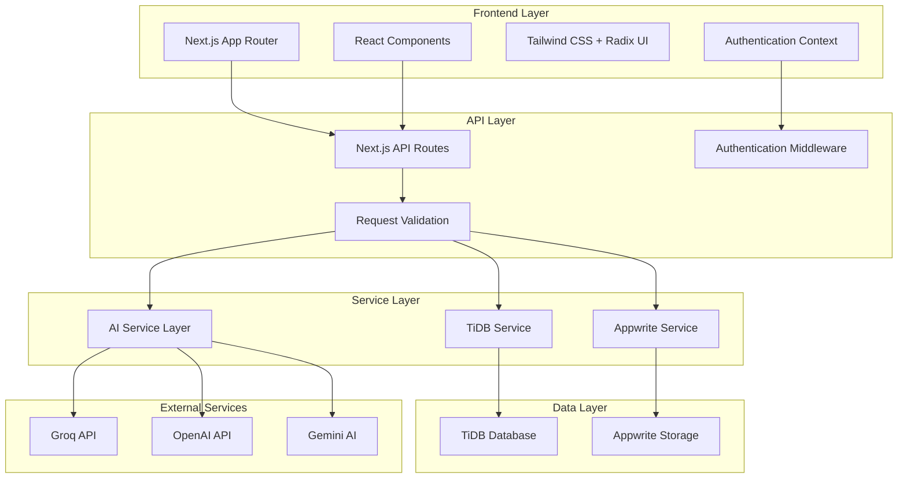

# Vio - AI-Native Learning Companion

Your AI-Native Learning Companion built with Next.js, TiDB, and Appwrite for the TiDB AgentX Hackathon 2025.

## 🚀 Quick Start

### Run Instructions

1. **Clone the repository**
   ```bash
   git clone <repository-url>
   cd Vio
   ```

2. **Install dependencies**
   ```bash
   npm install
   ```

3. **Set up environment variables**
   ```bash
   cp .env.example .env.local
   ```
   Fill in the required environment variables (see Environment Setup section below).

4. **Set up the database**
   ```bash
   npm run setup:tidb
   ```

5. **Start the development server**
   ```bash
   npm run dev
   ```

6. **Open your browser**
   Navigate to `http://localhost:3000` to view the application.

## 📋 Features & Functionality

### 🎯 Core Features

- **📚 Universal Content Management**: Upload, organize, and manage documents (PDF, Word, PowerPoint, Excel), images, YouTube videos, and website links
- **🤖 AI-Powered Chat**: Interactive chat interface with context-aware AI responses using multiple AI models
- **📝 Smart Summarization**: Automatic content summarization using Gemini AI for better comprehension
- **🧠 Intelligent Quizzing**: Generate and take quizzes based on uploaded content with multiple question types
- **🎧 Listening Tests**: Audio-based comprehension tests with text-to-speech integration
- **📊 Performance Analytics**: Detailed quiz results with topic-based performance analysis
- **🔍 Advanced Search**: TiDB-powered semantic search across all your documents and content with web search integration
- **📁 Workspace Organization**: Create folders and organize content with hierarchical structure
- **🗑️ Content Management**: Delete learning paths, research queries, and study sessions with hover-based UI
- **📱 Responsive Design**: Optimized for desktop and mobile with scrollable content areas

### 🤖 AI Agents & Multi-Step Workflows

- **🎯 Learning Path Generator**: Creates personalized learning paths based on your documents and goals
- **🔬 Research Assistant**: Conducts comprehensive research across your documents with AI-powered analysis
- **📚 Study Session Orchestrator**: Creates adaptive study sessions with real-time difficulty adjustment
- **🎬 Learning Script Studio**: Generates engaging educational video scripts based on your documents and topics
- **⚡ Interactive Study Interface**: Answer questions in real-time with immediate feedback and explanations
- **📈 Performance Dashboard**: Comprehensive analytics showing learning trends and improvement areas
- **⏯️ Session Management**: Pause, resume, and track progress across study sessions

### 🎮 Interactive Features

- **Real-time Chat**: Context-aware conversations with your documents
- **Dynamic Quiz Generation**: AI-generated questions based on document content
- **Audio Learning**: Text-to-speech for listening comprehension tests
- **Progress Tracking**: Monitor your learning progress with detailed analytics
- **Responsive Design**: Works seamlessly across desktop and mobile devices

## 🏗️ Architecture Overview

### System Architecture Diagram



## 🔄 Data Flow & Integrations

### 🗄️ Database Layer (TiDB)

**Core Tables:**
- **Users**: User profiles and authentication data
- **Workspaces**: User workspace organization with default workspace support
- **Dashboard Items**: Universal content metadata, content, and extracted text (documents, images, videos, web links)
- **Folders**: Hierarchical content organization
- **Quiz Results**: Quiz attempts, scores, and detailed performance analysis
- **Chat Messages**: Conversation history and AI interactions
- **Learning Paths**: AI-generated personalized learning paths
- **Learning Steps**: Individual steps within learning paths
- **Study Sessions**: Adaptive study sessions with progress tracking
- **Research Queries**: Research assistant queries and results
- **Video Generations**: Educational video script generation requests and results

**Data Relationships:**
- Users create workspaces and upload universal content (documents, images, videos, web links)
- Workspaces contain folders and dashboard items of all content types
- Learning paths contain multiple learning steps
- Study sessions track user progress and performance across all content types
- Research queries analyze multiple content sources

### 🤖 AI Integration Layer

**Multi-Model Architecture:**
- **Groq API**: Primary AI model for chat and quiz generation (`llama-3.1-8b-instant`)
- **OpenAI API**: Fallback AI model for chat responses (`gpt-3.5-turbo`)
- **Gemini AI**: Content summarization and analysis (`gemini-2.0-flash-exp`)
- **Text-to-Speech**: Browser-based speech synthesis for listening tests

**AI Service Features:**
- **Chat Service**: Context-aware conversations with universal content-based context retrieval
- **Quiz Generation**: Multiple question types with difficulty-based generation from all content types
- **Study Session Orchestration**: Knowledge assessment and adaptive question generation
- **Research Assistant**: Multi-content analysis and knowledge synthesis across documents, videos, and web content
- **Learning Path Generation**: Personalized learning path creation based on universal content analysis
- **Video Script Generation**: Educational video script creation with AI-powered content synthesis from all sources

### 🔐 Authentication & Security

**Authentication Flow:**
- **Appwrite**: User authentication and session management
- **JWT Tokens**: Secure API communication with token-based authentication
- **Server-side Validation**: Protected API endpoints with user verification

**Security Features:**
- **User Isolation**: Data segregation by user ID ensuring privacy
- **Input Sanitization**: XSS and injection prevention
- **Rate Limiting**: API request throttling to prevent abuse
- **CORS Configuration**: Secure cross-origin requests
- **Data Encryption**: Sensitive data encryption in transit and at rest

### 📊 Data Processing Pipeline

#### Universal Content Processing
1. **Content Upload**: User uploads documents, images, YouTube videos, or saves web links
2. **Validation**: Content type validation and size checking
3. **Content Extraction**: 
   - **Documents**: Advanced PDF processing with OCR fallback
   - **Images**: OCR text extraction and analysis
   - **YouTube Videos**: Transcript extraction and metadata processing
   - **Web Links**: Content scraping and parsing
4. **Text Cleaning**: Content normalization and structure extraction
5. **Metadata Generation**: AI-powered content analysis and tagging
6. **Database Storage**: TiDB storage with full-text search indexing

#### AI Chat Processing
1. **Context Retrieval**: Fetch relevant content from TiDB (documents, videos, web content)
2. **Model Selection**: Choose appropriate AI model (Groq/OpenAI/Gemini)
3. **Prompt Construction**: Build context-aware prompts with universal content
4. **Response Generation**: AI-powered response with fallback mechanisms
5. **Storage**: Save conversation history and context for future interactions

#### Study Session Processing
1. **Knowledge Assessment**: AI evaluation of user's current knowledge level
2. **Content Selection**: Optimal content selection based on learning goals (documents, videos, web content)
3. **Question Generation**: Adaptive question creation with difficulty progression
4. **Progress Tracking**: Real-time performance monitoring and analytics
5. **Feedback Generation**: Personalized feedback and learning recommendations

## 🛠️ Technology Stack

### Frontend
- **Next.js 14**: React framework with App Router for server-side rendering
- **TypeScript**: Type-safe development with comprehensive type definitions
- **Tailwind CSS**: Utility-first styling with responsive design
- **Radix UI**: Accessible component primitives for consistent UI
- **Lucide React**: Modern icon library with consistent design
- **Zustand**: Lightweight state management for global state
- **React Markdown**: Markdown rendering for AI responses and summaries

### Backend
- **Next.js API Routes**: Server-side API endpoints with middleware support
- **TiDB**: Distributed SQL database with horizontal scaling
- **Appwrite**: Authentication and user management with JWT tokens
- **MySQL2**: Database connection driver with connection pooling

### AI & External Services
- **Groq API**: Primary AI model provider (llama-3.1-8b-instant)
- **OpenAI API**: Secondary AI model provider (gpt-3.5-turbo)
- **Gemini AI**: Google's AI for summarization (gemini-2.0-flash-exp)
- **Browser APIs**: Text-to-speech and file handling for client-side features

### Development Tools
- **ESLint**: Code linting and quality assurance
- **Prettier**: Code formatting for consistent style
- **TypeScript**: Static type checking and development experience
- **Hot Reload**: Development server with fast refresh capabilities

## 🔧 Environment Setup

Create a `.env.local` file with the following variables:

```env
# Database Configuration
TIDB_HOST=your-tidb-host
TIDB_PORT=4000
TIDB_USER=your-tidb-user
TIDB_PASSWORD=your-tidb-password
TIDB_DATABASE=your-database-name

# Appwrite Configuration
APPWRITE_ENDPOINT=https://cloud.appwrite.io/v1
APPWRITE_PROJECT_ID=your-project-id
APPWRITE_API_KEY=your-api-key

# AI Services Configuration
GROQ_API_KEY=your-groq-api-key
OPENAI_API_KEY=your-openai-api-key
GEMINI_API_KEY=your-gemini-api-key

# Application Configuration
NEXTAUTH_URL=http://localhost:3000
NEXTAUTH_SECRET=your-nextauth-secret
```

### Database Setup

Run the database setup script to create all necessary tables:

```bash
npm run setup:tidb
```

This will:
- Create the TiDB database connection
- Set up all required tables
- Create indexes for optimal performance
- Initialize the database schema

## 📱 Demo Instructions

### For Judges/Reviewers

1. **Access the Application**: Navigate to `http://localhost:3000`
2. **Sign Up/Login**: Create an account or use existing credentials
3. **Upload Content**: Try uploading various content types (PDF, Word, images, YouTube videos, web links)
4. **Test Chat Feature**: Ask questions about your uploaded content
5. **Generate Quizzes**: Create quizzes from your documents
6. **Take Listening Tests**: Experience audio-based learning
7. **View Analytics**: Check your quiz results and performance
8. **Try AI Agents**: Test Learning Path Generator, Research Assistant, Study Session Orchestrator, and Learning Script Studio

### Key Demo Scenarios

#### Universal Content Management
- **Upload Multiple Content Types**: Upload PDF, Word, PowerPoint, Excel files, images, YouTube videos, and web links
- **Organize in Folders**: Create folders and organize all content types hierarchically
- **Search Functionality**: Use semantic search to find specific content across all media types

#### AI-Powered Features
- **Contextual Chat**: Ask questions about specific content (documents, videos, web pages)
- **Quiz Generation**: Generate quizzes with different difficulty levels from all content types
- **Smart Summarization**: Get AI-generated summaries of documents, videos, and web content

#### AI Agents & Workflows
- **Learning Path Generator**: Create personalized learning paths from all content types
- **Research Assistant**: Conduct research across multiple content sources (documents, videos, web pages)
- **Study Session Orchestrator**: Create and complete adaptive study sessions
- **Learning Script Studio**: Generate educational video scripts and video from your content
- **Interactive Study Interface**: Answer questions with real-time feedback

#### Performance Analytics
- **Quiz Results**: Review detailed performance analysis
- **Progress Tracking**: Monitor learning progress over time
- **Performance Dashboard**: View comprehensive learning analytics

## 🏆 Hackathon Focus

This project demonstrates the power of TiDB for:

### Scalability & Performance
- **Distributed Architecture**: Horizontal scaling capabilities for growing user base
- **Real-time Performance**: Fast query responses for interactive features
- **Concurrent Users**: Support for multiple simultaneous users and sessions
- **Large Datasets**: Efficient handling of documents, analytics, and AI-generated content

### Data Integrity & Reliability
- **ACID Compliance**: Reliable transactions for critical operations
- **Data Consistency**: Consistent data across distributed nodes
- **Backup & Recovery**: Built-in data protection mechanisms
- **Fault Tolerance**: High availability and disaster recovery capabilities

### Advanced Features
- **Complex Relationships**: Managing user workspaces, folders, and content hierarchies
- **JSON Support**: Flexible storage for AI-generated content and metadata
- **Full-text Search**: Advanced search capabilities across document content
- **Analytics Queries**: Complex aggregations for performance tracking and insights

### Use Cases Demonstrated
- **Educational Platform**: Learning management system with AI integration
- **Content Management**: Document organization and processing pipeline
- **Analytics Dashboard**: Performance tracking and reporting system
- **Multi-tenant Architecture**: User isolation and workspace management

## 📚 Additional Documentation

For detailed architecture documentation, data flow diagrams, and technical specifications, see:
- **[ARCHITECTURE.md](./ARCHITECTURE.md)**: Comprehensive architecture documentation with detailed diagrams

## 🆕 Recent Updates & Improvements

### Latest Features (v1.2.0)

#### 🔍 Enhanced Search System
- **TiDB Integration**: Migrated from Appwrite to TiDB for faster, more reliable search
- **Multi-Content Search**: Search across documents, folders, and quiz results simultaneously
- **User ID Mapping**: Proper authentication and user data isolation
- **Workspace Scoping**: Search results automatically scoped to user's workspace

#### 🗑️ Content Management
- **Delete Functionality**: Added delete buttons for learning paths, research queries, and study sessions
- **Hover UI**: Delete buttons appear on hover for clean, intuitive interface
- **Confirmation Dialogs**: Safe deletion with user confirmation prompts
- **Real-time Updates**: UI updates immediately after successful deletion

#### 🎨 UI/UX Improvements
- **Scrollable Content**: Context selection and generated content lists are now scrollable
- **Auto-resize Textarea**: Chat input automatically resizes when content is inserted programmatically
- **Sidebar Navigation**: Improved active tab highlighting with URL synchronization
- **Responsive Design**: Better mobile and desktop experience

#### 🛠️ Technical Improvements
- **Error Handling**: Enhanced AI response parsing with regex extraction and fallback handling
- **API Reliability**: Improved error handling and user feedback
- **Performance**: Optimized database queries and response times
- **Security**: Enhanced user authentication and data protection

### Bug Fixes
- ✅ Fixed search functionality returning 0 results
- ✅ Resolved textarea auto-resize issues
- ✅ Fixed sidebar navigation highlighting
- ✅ Improved AI response parsing and error handling
- ✅ Enhanced delete operation security and user verification

## 🚀 Future Enhancements

### Planned Features
- **Collaborative Learning**: Multi-user study sessions and group projects
- **Advanced Analytics**: Machine learning insights and recommendations
- **Mobile App**: Native mobile application for iOS and Android
- **Integration APIs**: Third-party integrations with learning management systems

### Technical Improvements
- **Caching Layer**: Redis integration for improved performance
- **CDN Integration**: Global content delivery for documents
- **Microservices**: Service decomposition for better scalability
- **Event Streaming**: Real-time updates and notifications
- **Advanced Security**: Enhanced authentication and data encryption

## 📄 License

This project is created for the TiDB AgentX Hackathon 2025.

---

Built with ❤️ using Next.js, TiDB, and Appwrite

**Key Contributors**: AI-Native Learning Companion Team  
**Hackathon**: TiDB AgentX Hackathon 2025  
**Technologies**: Next.js 14, TiDB, Appwrite, Groq, OpenAI, Gemini AI
