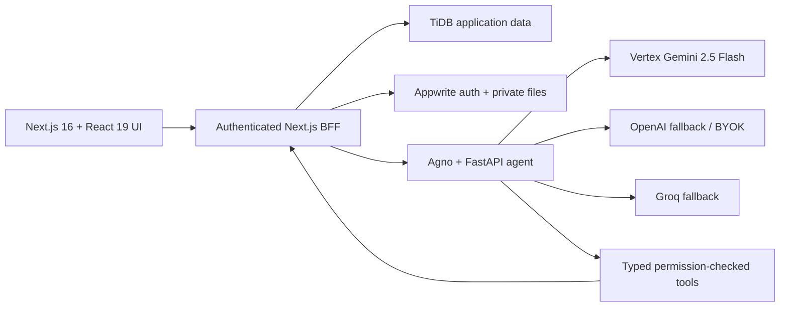

<div align="center">

# Vio

### The AI grader that never grades without you.

**An evidence-grounded AI education workspace where teachers stay in control of assessment.**

[](https://vio-pcuh.onrender.com)
[](https://openai.devpost.com/)
[](#how-we-built-vio-with-codex-and-gpt-56)

[Live app](https://vio-pcuh.onrender.com) · [Architecture](ARCHITECTURE.md) · [Build story](#the-story-behind-vio)

[](https://vio-pcuh.onrender.com)

</div>

Vio was built for the **Education** track of [OpenAI Build Week](https://openai.devpost.com/). It combines an AI study workspace with a classroom workflow: teachers create assignments, students submit text or files, AI prepares an evidence-backed evaluation, and the teacher reviews, overrides, and explicitly publishes the final result.

The goal is not autonomous grading. It is faster, more consistent feedback with a clear human-in-the-loop boundary.

## ⚡ For judges: the 60-second path

| | |
| --- | --- |
| **Open first** | [Launch the live app](https://vio-pcuh.onrender.com). The free-tier service may need about 60 seconds to wake up. |
| **Core workflow** | Create a teacher account and classroom, publish an assignment, submit work from a student account, then review and publish the AI draft as the teacher. |
| **Signature moment** | Change an AI-proposed score or feedback field, record the reason, and publish. The student sees nothing as final before teacher approval. |
| **What this proves** | Vio evaluates an immutable submission, cites evidence, preserves teacher authority, and audits the decision instead of silently auto-grading. |
| **Repeatable path** | Create teacher and student accounts, submit one assignment, then review, override, and publish the AI draft. |

## The 30-second story

Most AI grading products end with a score. Vio ends with a **teacher decision**.

1. A teacher creates evidence-grounded homework.
2. A student submits a text answer and/or files.
3. Vio evaluates that exact immutable submission and cites its evidence.
4. The teacher can edit the score, feedback, strengths, weaknesses, and suggestions.
5. Nothing is shown as final until the teacher explicitly publishes it.

This is Vio's product promise: **AI proposes; teachers dispose.**

## The story behind Vio

Vio did not begin as a hackathon idea. It was one of my first serious coding projects, built as a personal learning companion while I was still learning how to turn an idea into a working product.

When I started thinking about what to build for the Education track, I asked my Japanese language teacher a simple question: **“What should exist that would make everyday life easier for you, both as a teacher and as a student?”**

She described a problem hidden inside an ordinary routine. Students send homework through messages every day, filling her storage with files. She then has to check every conversation manually, work out who submitted, identify who did not, and keep separate notes so nobody is missed. The work is repetitive, difficult to track, and takes time away from teaching.

That conversation changed Vio's direction. The foundation of a learning platform already existed, but the classroom workflow did not. I realized Vio could become the place where students submit work, teachers see submission status at a glance, and AI prepares evidence-backed feedback without taking the final decision away from the teacher.

There was one catch: because the original Vio was built near the beginning of my coding journey, its architecture had grown messy and its AI assistant needed a major rethink. Instead of adding one more feature on top, I decided to rebuild the foundations. Working with Codex powered by GPT-5.6, I reorganized the codebase, consolidated the AI layer, and built the classroom and review workflow. The first major implementation pass completed roughly 80% of my planned rebuild, which surprised me. I then reviewed the result, made the product decisions, tested the teacher/student boundaries, debugged production failures, tightened security, and refined the experience through repeated deployments.

Vio's most important feature therefore came from a real teacher's everyday problem, while its rebuild became an experiment in how far one person can go when human judgment and an AI engineering collaborator work together.

## Why Vio

Teachers often lose time moving between learning material, assignment tools, grading, and generic AI chat. Students receive feedback late and frequently cannot see the evidence behind it. Vio brings these workflows together while preserving three important guarantees:

- AI evaluations are drafts; the teacher is the final authority.
- Uploaded knowledge and classroom data are permission-scoped.
- Sensitive actions such as publishing grades require explicit confirmation and are audited.

## What works

<details open>
<summary><strong>Classroom management</strong></summary>

- Create and archive classrooms.
- Invite students with expiring, revocable links or codes.
- Create draft or published assignments with lesson/chapter metadata, due dates, instructions, maximum marks, rubric data, and attachments.
- Accept immutable, versioned text and file submissions with late/resubmission policies.
- Generate a structured AI evaluation with score, feedback, strengths, weaknesses, improvements, confidence, and evidence.
- Let teachers recheck, override, save a review draft, and explicitly publish authoritative results.
- Keep AI feedback hidden from students until the teacher publishes the review.

</details>

<details open>
<summary><strong>AI workspace</strong></summary>

- Streaming chat with Streamdown rendering, code blocks, tables, tool events, citations, retry, and durable conversation history.
- Typed tools with authorization checks, structured results, failure recovery, and approval pauses for sensitive writes.
- Persistent session summaries and curated user memories that can be inspected or deleted.
- PDF, DOCX, PPTX, spreadsheet, image/OCR, text, audio, and video ingestion paths with extraction status and grounded retrieval.
- Learning-path generation, research assistance, adaptive study sessions, standard quizzes, and listening tests.
- Vertex AI Gemini 2.5 Flash as the built-in primary provider, with OpenAI and Groq fallback only for retryable provider failures.
- Optional user-funded OpenAI Platform API keys, encrypted before storage.

</details>

## Three-minute demo story

1. A teacher creates a classroom and evidence-grounded homework.
2. A student joins and submits multimodal work.
3. Vio evaluates the exact immutable submission version.
4. The teacher reviews the evidence, changes the draft score with a reason, and publishes.
5. The student sees teacher-authoritative feedback with AI content clearly labeled.
6. The Vio agent answers a follow-up using memory and tools, then demonstrates safe recovery from a failed tool.

This flow can be reproduced with two accounts and one short assignment; no seed data or mocked grading records are required.

## Architecture


```mermaid
flowchart LR
  U["Next.js 16 + React 19 UI"] --> B["Authenticated Next.js BFF"]
  B --> D["TiDB application data"]
  B --> S["Appwrite auth + private files"]
  B --> A["Agno + FastAPI agent"]
  A --> V["Vertex Gemini 2.5 Flash"]
  A --> O["OpenAI fallback / BYOK"]
  A --> G["Groq fallback"]
  A --> T["Typed permission-checked tools"]
  T --> B
```

The production Render image runs the Next.js application and private FastAPI agent together, applies checksum-verified TiDB migrations at startup, and performs homework evaluation inline. This keeps the public deployment in one service without Cloud KMS or Cloud Tasks. User API keys are protected with a server-only 32-byte application encryption key.

The agent never receives unrestricted SQL access. It calls constrained internal BFF tools using short-lived signed context, and every tool call rechecks ownership or classroom role. See [ARCHITECTURE.md](ARCHITECTURE.md) for provider, memory, retrieval, and grading flows.

## Technology

| Layer | Technology | What it delivers |
| --- | --- | --- |
| **Experience** | Next.js 16, React 19, TypeScript, Tailwind CSS, shadcn/ui | Accessible teacher, student, and assistant workflows |
| **Streaming agent** | Python, FastAPI, Agno, Pydantic, Streamdown, SSE | Typed tools, structured events, citations, and durable memory |
| **AI providers** | Vertex Gemini 2.5 Flash, OpenAI, Groq | Multimodal generation with retry-aware provider fallback |
| **Application data** | TiDB/MySQL, checksum-verified SQL migrations | Transactional classrooms, submissions, reviews, memory, and audit data |
| **Identity and files** | Appwrite | Authentication and permission-scoped private storage |
| **Deployment** | Docker, Render Blueprint | Reproducible web and agent deployment as one service |
| **Quality gates** | Vitest, Playwright, pytest, ESLint | Unit, contract, live, accessibility, and agent verification |

## Run locally

### Prerequisites

- Node.js 20.9 or newer
- npm 10
- Python 3.11 or newer
- A TiDB Cloud or MySQL-compatible database
- An Appwrite project
- A Google Cloud project with Vertex AI enabled

### 1. Clone and install

```bash
git clone https://github.com/AdarshSingh-ASR/Vio.git
cd Vio
npm ci
```

### 2. Configure Appwrite

1. Create an Appwrite project and add a **Next.js web platform**.
2. Use `localhost` for local development and add the deployed hostname for production.
3. Enable the authentication provider you want to use. For Google OAuth, configure Appwrite's displayed callback URL in Google Cloud.
4. Create **one private storage bucket**. A single bucket is sufficient; use its ID for the files, images, and videos variables.
5. Enable file-level security and allow authenticated users to create files.
6. Create a server API key with the minimum authentication/user and storage permissions required by the application.

Appwrite Database is not used for active application data. `APPWRITE_DATABASE_ID` is needed only when migrating notes from a legacy Vio installation.

### 3. Configure environment variables

Copy the template:

```bash
# macOS/Linux
cp env.example .env

# Windows PowerShell
Copy-Item env.example .env
```

Required values:

| Variable | How it is used |
| --- | --- |
| `APPWRITE_ENDPOINT`, `APPWRITE_PROJECT_ID`, `APPWRITE_API_KEY` | Server-side Appwrite access |
| `NEXT_PUBLIC_APPWRITE_ENDPOINT`, `NEXT_PUBLIC_APPWRITE_PROJECT_ID` | Browser authentication |
| `APPWRITE_FILES_BUCKET_ID`, `NEXT_PUBLIC_APPWRITE_FILES_BUCKET_ID` | Private file bucket; reuse this ID for image/video variables on the free plan |
| `NEXT_PUBLIC_APP_URL` | `http://localhost:3000` locally |
| `TIDB_HOST`, `TIDB_PORT`, `TIDB_USER`, `TIDB_PASSWORD`, `TIDB_DATABASE`, `TIDB_SSL` | TiDB connection |
| `AGENT_SHARED_SECRET` | At least 32 random bytes shared by the web and agent processes |
| `AGNO_DATABASE_URL` | SQLAlchemy/PyMySQL URL for durable agent sessions |
| `AI_CREDENTIAL_ENCRYPTION_KEY` | Base64-encoded 32-byte key for user-supplied provider credentials |
| `GOOGLE_CLOUD_PROJECT`, `GOOGLE_CLOUD_LOCATION` | Vertex AI project and region |
| `GOOGLE_VERTEX_CREDENTIALS` or Application Default Credentials | Raw JSON or base64-encoded Vertex service-account credentials; the Render startup script writes these to an ephemeral file |

Generate local secrets:

```bash
openssl rand -base64 32   # AI_CREDENTIAL_ENCRYPTION_KEY
openssl rand -hex 32      # AGENT_SHARED_SECRET
```

Provider/integration variables such as `OPENAI_API_KEY`, `GROQ_API_KEY`, `OPENROUTER_API_KEY`, `TAVILY_API_KEY`, and TTS keys are optional. At least Vertex must be configured for built-in AI. Never commit `.env` or service-account JSON.

### 4. Initialize the database

```bash
npm run setup:tidb
```

The migration runner creates a baseline database, applies every numbered migration, records checksums in `schema_migrations`, and refuses modifications to migrations that have already run.

### 5. Start the agent

```bash
cd services/agent
python -m venv .venv

# macOS/Linux
source .venv/bin/activate

# Windows PowerShell
.venv\Scripts\Activate.ps1

pip install -r requirements.txt
uvicorn app.main:app --host 127.0.0.1 --port 8081 --reload
```

Set `AGENT_SERVICE_URL=http://127.0.0.1:8081` and `VIO_INTERNAL_API_URL=http://127.0.0.1:3000` locally.

### 6. Start the web application

In another terminal:

```bash
npm run dev
```

Open [http://localhost:3000](http://localhost:3000), sign in, upload a small document, create a classroom, and open the Vio assistant.

## Sample and demo data

No seed data is required. Vio intentionally demonstrates real authorization, storage, AI responses, and teacher/student boundaries rather than mocked grading records.

For a reproducible evaluation:

1. Create two real accounts: one teacher and one student.
2. As the teacher, create a classroom and assignment with a maximum score of 100.
3. Join with the student account using the generated code.
4. Submit a short answer and a PDF or image.
5. Return as the teacher, review the AI draft, override one field with a reason, and publish.

This creates all sample data through supported product flows and exercises the real authorization, submission, evaluation, and publication boundaries.

## Deploy the complete application on Render

The included [render.yaml](render.yaml) and [Dockerfile.render](Dockerfile.render) deploy the web app and agent in one Render service.

1. Fork or connect this repository in Render.
2. Choose **New → Blueprint** and select the repository.
3. Add the secret values marked `sync: false` in `render.yaml`.
4. Ensure the `NEXT_PUBLIC_*` values are available during the Docker build.
5. Deploy. The container runs migrations before starting both services.
6. Add the final Render hostname to Appwrite's web platform and OAuth configuration.
7. Verify `https://YOUR_HOST/api/health` returns `{"status":"ok","service":"vio-web"}`.

The free Render tier can sleep after inactivity, so the first request may take approximately a minute. Production or judging demos should warm the service before recording.

## Verification

Run the local quality gates:

```bash
npm run type-check
npm test
npm run lint
npm run build
python -m compileall services/agent/app
```

The unit suite does not require live AI credentials. The repository also includes infrastructure, teacher/student, stream-reconnection, accessibility, and load checks.

## How we built Vio with Codex and GPT-5.6

Codex was the engineering environment and collaborator; GPT-5.6 was the reasoning model used through Codex. This was not a one-shot generation. Our repeated loop was: inspect the repository, propose a phased plan, implement a bounded change, run tests, deploy, inspect real production behavior, and repair issues using concrete logs.

### Where Codex accelerated the work

- **Repository-wide architecture review:** Codex traced routes, persistence boundaries, providers, uploads, native rendering dependencies, and authorization paths before code was changed.
- **Large safe refactor:** it removed Learning Script Studio and its FFmpeg/Manim infrastructure while checking that shared quiz and TTS dependencies remained in use.
- **AI consolidation:** it helped replace scattered direct model calls with a provider contract, retry classification, structured generation, streaming, typed tools, and durable memory.
- **Classroom implementation:** it generated and connected migrations, authorization rules, versioned submissions, evaluation records, teacher drafts, overrides, publication, and audit events.
- **Production debugging:** Codex read Render and CI failures, reproduced the relevant code paths, and fixed Linux asset casing, Python import paths, optional Rollup dependencies, build-time Tavily initialization, Appwrite bucket permissions, TiDB JSON/prepared-statement behavior, and unsupported query patterns.
- **Quality gates:** it added and repeatedly ran migration, security, memory-policy, credential, approval, file-security, and persistence tests before pushing changes.
- **UI refinement:** Codex iterated from screenshots while we made the product decisions—preserve Vio's theme, remove decorative “AI slop,” simplify the assistant header, use the Vio identity for responses, and keep the teacher workflow explicit.

### Decisions made together

| Product or engineering choice | Principle | Why it matters |
| --- | --- | --- |
| **Teacher-authoritative grading** | Human control | AI accelerates review but never silently publishes a grade. |
| **Vertex primary, OpenAI/Groq fallback** | Resilience | Retry-aware fallback improves availability without crossing safety or billing boundaries. |
| **Typed internal tools, not raw SQL** | Least authority | Every agent action remains constrained, validatable, and auditable. |
| **TiDB as the source of truth** | Transactional integrity | Classroom, memory, conversation, and audit state stay consistent. |
| **One private Appwrite bucket** | Permission-scoped storage | File-level access controls remain practical on the free tier. |
| **Application-level key encryption** | Secret protection | User API keys remain encrypted at rest without adding Cloud KMS to the single-service demo. |
| **Inline evaluation** | Reproducibility | The hackathon deployment avoids a Cloud Tasks dependency. |
| **One Render container** | Judge-friendly deployment | The complete web and agent system runs from one repository and one service. |

GPT-5.6 was especially valuable for long-context repository reasoning: it kept frontend, Python agent, migrations, deployment files, and live production evidence in one working model. We retained human control over scope, product priorities, credentials, external accounts, and sensitive production actions. Codex proposed and implemented; we reviewed the tradeoffs, selected the deployment and UX direction, supplied credentials through secure platform settings, and approved releases.

For the submission, the required `/feedback` Codex Session ID is provided in the Devpost form rather than committed to the repository.

## How Vio addresses the judging criteria

| Criterion | Evidence in Vio |
| --- | --- |
| Technological implementation | Non-trivial Codex-assisted implementation spanning a typed agent, provider fallback, durable memory, multimodal retrieval, authorization, migrations, and audited human approval. |
| Design | A cohesive teacher-to-student workflow, streaming assistant, accessible component system, clear processing states, and teacher/AI responsibility labels. |
| Potential impact | Reduces grading turnaround while preserving educator control and giving students evidence-linked, actionable feedback. |
| Quality of the idea | Treats AI as a review collaborator rather than an autonomous grader, combining classroom operations, grounded evidence, memory, tools, and failure recovery in one product. |

## Build Week: what changed

Vio began as a learning workspace with several disconnected AI flows. During Build Week, the core product became a production-oriented classroom system:

| Before | During Build Week |
| --- | --- |
| Direct model calls scattered across features | One provider contract with Vertex primary and OpenAI/Groq fallback |
| Chat without durable context | Streaming agent runs, summaries, curated memory, and typed tools |
| AI output treated as the result | Versioned submissions, evidence-backed drafts, teacher override, and explicit publication |
| Runtime database setup | Checksum-verified numbered migrations and audit events |
| Separate deployment assumptions | One Render service running the web app and private agent together |
| Renderer-heavy Learning Script Studio | Removed native rendering infrastructure to keep the product deployable and maintainable |

The public demo should show this progression rather than a collection of disconnected AI features.

## Security notes

- Decrypted provider credentials never return to the browser.
- Credentials, service-account material, prompts, and grading content are redacted from logs.
- Every classroom and tool request revalidates the authenticated user and resource role.
- Invitation codes are hashed, expirable, revocable, rate-limited, and usage-limited.
- Submission attempts are immutable and versioned.
- AI grading stays hidden until an authorized teacher publishes a review.
- Prompt-injected files do not grant tools additional permissions.

## Repository map

```text
src/app/                 Next.js pages and API routes
src/components/          Shared UI and assistant interface
src/lib/                 Auth, TiDB, classroom, memory, retrieval, providers
services/agent/app/      FastAPI/Agno agent, tools, security, evaluation
migrations/              Ordered checksum-verified SQL migrations
tests/                   Unit, security, migration, and live test suites
render.yaml              One-service Render Blueprint
Dockerfile.render        Combined web + agent production image
```

## Current limitations

- The free Render instance may cold-start after inactivity.
- A genuine teacher/student test requires two accounts; Vio does not bypass identity boundaries for demos.
- Provider availability and cost depend on the credentials configured by the deployer.
- OCR, transcription, and large-file processing are intentionally constrained by upload limits on the single-service hackathon deployment.

## License and submission

This repository is the source submission for OpenAI Build Week's Education track. Add the repository's chosen license before final Devpost submission if public judging requires reuse terms.

---

<div align="center">

### Vio

**AI proposes. Teachers decide. Students receive feedback they can trust.**

[Open the live app](https://vio-pcuh.onrender.com)

</div>
